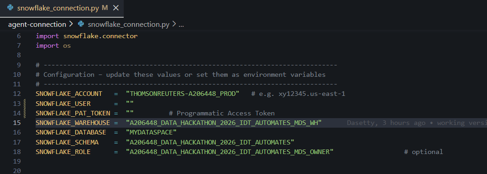
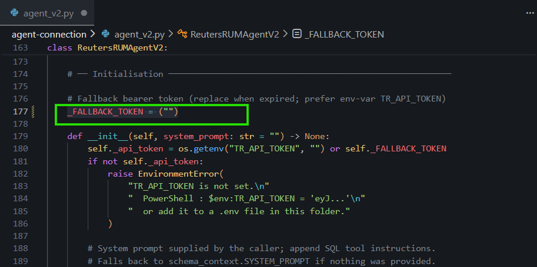

# TR Content Licensing Analytics

A natural language query interface for Thomson Reuters content licensing data, powered by Claude LLM and Snowflake.

## Architecture Overview

```
+-------------------------------------------------------------------+
|                        React Frontend                              |
|  +-------------+  +-------------+  +-------------+                 |
|  |    Chat     |  |    Data     |  |    Data     |                 |
|  |  Interface  |  |    Table    |  |    Chart    |                 |
|  +-------------+  +-------------+  +-------------+                 |
+-------------------------------------------------------------------+
                              |
                              v
+-------------------------------------------------------------------+
|                   Python Flask Backend API                         |
|  +---------------------------------------------------------------+ |
|  |  /api/analyst/query   - Natural language to SQL via Claude    | |
|  |  /api/analyst/session - Conversation management               | |
|  |  /api/metadata        - Categories, metrics                   | |
|  +---------------------------------------------------------------+ |
+-------------------------------------------------------------------+
                    |                       |
                    v                       v
+---------------------------+   +---------------------------+
|      Claude LLM           |   |      Snowflake            |
|   (via LiteLLM Proxy)     |   |   (PAT Token Auth)        |
|  +---------------------+  |   |  +---------------------+  |
|  | Text-to-SQL         |  |   |  | Query Execution     |  |
|  | Answer Generation   |  |   |  | Data Storage        |  |
|  +---------------------+  |   |  +---------------------+  |
+---------------------------+   +---------------------------+
```

## How It Works

1. **User asks a question** in natural language via the chat interface
2. **Backend sends the question to Claude LLM** along with the database schema context
3. **Claude generates a SQL query** based on the schema and question
4. **SQL is executed against Snowflake** using PAT token authentication
5. **Results are sent back to Claude** for natural language summarization
6. **Response is displayed** in the frontend with data table and optional chart

## Features

- **Natural Language Queries**: Ask questions in plain English about content licensing data
- **LLM-Powered SQL Generation**: Claude generates accurate SQL based on your schema
- **Intelligent Responses**: Claude summarizes query results in natural language
- **Auto-visualization**: Results displayed as charts or tables based on data type
- **SQL Transparency**: View generated SQL for each query
- **Export Capability**: Download results as CSV or JSON
- **Suggested Queries**: Context-aware query suggestions

## Quick Start

### Prerequisites

- Python 3.10+
- Node.js 18+
- Snowflake account with PAT token
- Access to LiteLLM proxy (for Claude)

### 1. Set Up Backend

```bash
cd backend-python

# Install dependencies
pip install flask flask-cors snowflake-connector-python openai python-dotenv

# Run the server
python app.py
```

The backend will start at http://localhost:3001

### 2. Set Up Frontend

```bash
cd frontend

# Install dependencies
npm install

# Start the development server
npm start
```

Open http://localhost:3000

## Configuration

### Backend Configuration (agent-connction/snowflake-connection.py)


```python

# Snowflake Configuration (PAT Token Authentication)
SNOWFLAKE_ACCOUNT = "THOMSONREUTERS-A206448_PROD"
SNOWFLAKE_USER = "your-email@thomsonreuters.com"
SNOWFLAKE_PAT_TOKEN = "your-pat-token"
SNOWFLAKE_WAREHOUSE = "your-warehouse"
SNOWFLAKE_DATABASE = "MYDATASPACE"
SNOWFLAKE_SCHEMA = "A206448_DATA_HACKATHON_2026_IDT_AUTOMATES"
SNOWFLAKE_ROLE = "your-role"
```
### Agent Configuration (Insert the api token from the Open Arena model and provide it in the _FALLBACK_TOKEN as shown below)


### Frontend Configuration (frontend/.env)

```
REACT_APP_API_URL=http://localhost:3001/api
```

## Database Schema

The application queries the following Snowflake tables:

| Table | Description |
|-------|-------------|
| `V_GOLD_FACT_ITEM_ORDERED` | Main fact table with order line items and revenue |
| `V_GOLD_BILLING_ACCOUNT_DIM` | Customer billing account dimension |
| `V_GOLD_CONTACT_DIM` | Contact/user dimension |
| `V_GOLD_ORGANIZATION_ACCOUNT_DIM` | Organization account dimension |
| `V_GOLD_USAGE_AGREEMENT_CONTRACT_DIM` | License/contract agreements |
| `V_GOLD_FACT_CONTENT_LICENSE_CONTRACT_CREATED` | Content licensing events |

## Sample Queries

Try these natural language queries:

- "What is the total revenue?"
- "Show me revenue by country"
- "Top 10 customers by revenue"
- "Monthly revenue trend"
- "Revenue breakdown by media type"
- "Revenue by industry"
- "Show orders by status"
- "Top photographers by revenue"
- "How many customers do we have?"

## Project Structure

```
rum-analytics/
|-- frontend/                 # React TypeScript frontend
|   |-- src/
|   |   |-- components/       # React components
|   |   |   |-- ChatMessage.tsx
|   |   |   |-- ChatInput.tsx
|   |   |   |-- DataTable.tsx
|   |   |   +-- DataChart.tsx
|   |   |-- styles/           # CSS styles
|   |   |   +-- App.css
|   |   +-- App.tsx           # Main application
|   +-- public/
|
|-- backend-python/           # Python Flask API server
|   |-- app.py                # Main application with LLM integration
|   +-- .env                  # Environment configuration
|
+-- semantic-model/           # Semantic model for reference
    +-- rum_content_model.yaml
```

## API Endpoints

| Endpoint | Method | Description |
|----------|--------|-------------|
| `/api/analyst/query` | POST | Submit natural language query |
| `/api/analyst/session` | POST | Create conversation session |
| `/api/analyst/suggestions` | GET | Get query suggestions |
| `/api/analyst/export` | POST | Export query results |
| `/api/metadata/categories` | GET | List content categories |
| `/api/metadata/metrics` | GET | List available metrics |
| `/api/health` | GET | Health check (includes LLM status) |

### Query Request/Response

**Request:**
```json
{
  "question": "What is the total revenue?",
  "sessionId": "optional-session-id"
}
```

**Response:**
```json
{
  "success": true,
  "answer": "The total revenue is $1,234,567.89 USD.",
  "sql": "SELECT SUM(TOTAL_AMOUNT_WITHOUT_TAX_HOME) as TOTAL_REVENUE FROM V_GOLD_FACT_ITEM_ORDERED",
  "data": {
    "columns": ["TOTAL_REVENUE"],
    "rows": [{"TOTAL_REVENUE": 1234567.89}],
    "rowCount": 1,
    "executionTime": 245.5
  },
  "suggestions": ["Revenue by country", "Revenue by industry"],
  "llmGenerated": true
}
```

## Technology Stack

| Component | Technology |
|-----------|------------|
| Frontend | React, TypeScript, Recharts |
| Backend | Python, Flask, Flask-CORS |
| LLM | Claude (via LiteLLM proxy) |
| Database | Snowflake |
| Authentication | PAT Token (Programmatic Access Token) |

## Troubleshooting

### "Password is empty" error
- Ensure you have snowflake-connector-python >= 3.10.0
- Verify PAT token is correctly set
- Check that authenticator is set to "programmatic_access_token"

### "Failed to connect to Snowflake"
- Verify account name format
- Check PAT token is valid and not expired
- Ensure warehouse is not suspended

### "403 Forbidden" from LLM
- Verify LiteLLM proxy URL includes `/v1` path
- Check API key is correct
- Ensure you have access to the model

### "Failed to generate SQL"
- Check Claude/LiteLLM configuration
- Verify API key has proper permissions
- Check network connectivity to LiteLLM proxy

## License

Internal use only - Thomson Reuters Data Hackathon 2026
